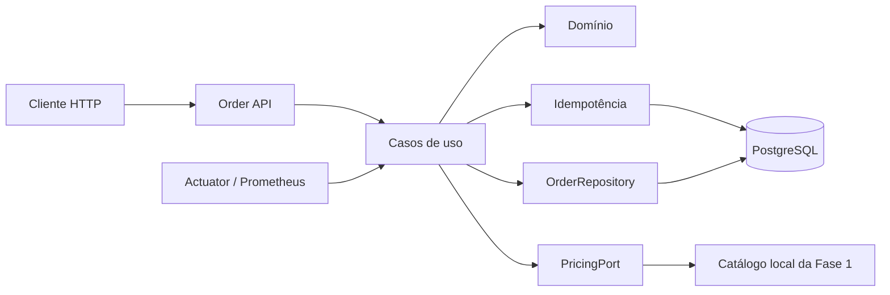
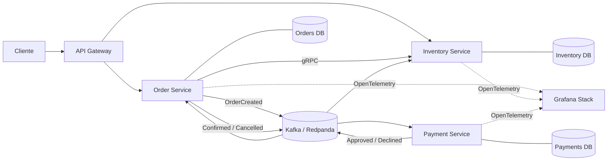

# E-commerce Microservices with Java

> Laboratório acadêmico de arquitetura distribuída, desenvolvido de forma
> incremental para explorar consistência, resiliência, observabilidade e
> operação de microserviços.


## Sobre o projeto

Este repositório implementa um e-commerce distribuído como projeto de estudo e
portfólio. A proposta não é apenas criar vários serviços, mas documentar e testar
os problemas que surgem quando uma operação atravessa banco de dados, chamadas
síncronas, eventos e múltiplas réplicas.

O desenvolvimento segue fases pequenas e verificáveis. Cada fase precisa compilar,
subir localmente e passar pelos testes antes da próxima. O plano detalhado está em
[`inicial.md`](inicial.md), e decisões relevantes são registradas como
[ADRs](docs/adr/).

## Estado atual

**Fase 1 — Fundação endurecida: concluída e validada.**

Hoje o repositório contém um `order-service` funcional. Os demais serviços e a
comunicação distribuída aparecem no roadmap, mas ainda não são apresentados como
implementados.

| Componente | Tecnologia | Estado |
|---|---|---|
| `order-service` | Spring Boot 3.5 | Concluído |
| PostgreSQL de pedidos | PostgreSQL 16 + Flyway | Concluído |
| Infraestrutura local | Docker Compose + Redpanda | Validada |
| `inventory-service` | Micronaut 4 + gRPC | Próxima fase |
| `payment-service` | Spring Boot + Kafka | Planejado |
| Kubernetes e Helm | kind + Helm | Planejado |
| Observabilidade | OpenTelemetry + Grafana Stack | Planejado |
| `api-gateway` | Spring Cloud Gateway + JWT | Planejado |

## O que já está implementado

- Clean/Hexagonal Architecture com `domain`, `application`, `infrastructure` e `api`.
- Regras de dependência e ausência de ciclos verificadas com ArchUnit.
- Criação e consulta de pedidos com PostgreSQL real.
- Migrations incrementais e schema validado pelo Flyway.
- Máquina de estados do pedido protegida por métodos de domínio.
- `Idempotency-Key` transacional, inclusive para chamadas concorrentes.
- Hash do request para impedir reutilização da chave com outro conteúdo.
- Constraints de unicidade no banco como última linha de defesa.
- Paginação limitada com `Slice` e projeção resumida, sem `findAll()`.
- Detalhe do pedido carregado separadamente, evitando N+1 na listagem.
- Limites de body, quantidade de itens, SKU, quantidade e precisão monetária.
- Preço obtido por `PricingPort`; o cliente não escolhe o valor cobrado.
- Moeda persistida e optimistic locking com `@Version`.
- Respostas de erro no formato `ProblemDetail`.
- Virtual Threads, graceful shutdown, readiness e métricas Prometheus.
- Testes unitários, de arquitetura e de integração com Testcontainers.

## Arquitetura atual



Dentro do serviço, o domínio não conhece Spring, HTTP ou JPA. A aplicação depende
de ports; adapters de infraestrutura implementam persistência, idempotência e
preço.

## Arquitetura alvo



Essa é a arquitetura do roadmap, não o estado atual do código.

## Destaques técnicos

### Idempotência sem memória local

O cliente envia `Idempotency-Key` ao criar um pedido. O PostgreSQL mantém uma
claim única por cliente e chave. Chamadas concorrentes são serializadas com lock,
e a claim é ligada ao pedido na mesma transação.

```text
mesma chave + mesmo conteúdo      -> retorna o pedido original
mesma chave + conteúdo diferente  -> 409 Conflict
chaves diferentes                 -> pedidos diferentes
```

Isso funciona após reinício e com múltiplas réplicas. O teste de integração
executa duas chamadas concorrentes e confirma que apenas um pedido é criado.

### Proteção contra carga ilimitada

A listagem utiliza `Slice`, ordenação estável e tamanho máximo de 100. Ela retorna
um resumo sem materializar os itens de todos os pedidos. O endpoint de detalhe
carrega um agregado por vez.

Requests também têm limites antes da persistência, evitando transformar uma lista
ou payload arbitrariamente grande em pressão de heap.

### Defesa em profundidade

Invariantes importantes aparecem em mais de uma camada:

- validação HTTP para feedback rápido;
- domínio para proteger chamadas internas;
- constraints no PostgreSQL para concorrência e integridade final.

## Tecnologias

### Em uso

- Java 21
- Spring Boot 3.5
- Spring Web, Validation, Data JPA e Actuator
- PostgreSQL 16
- Flyway
- Maven
- Docker Compose
- Testcontainers
- JUnit 5, AssertJ, Mockito e ArchUnit
- Micrometer Prometheus
- Redpanda e Redpanda Console como infraestrutura preparada para a próxima fase

### Planejadas

- Micronaut 4
- gRPC e Protocol Buffers
- Kafka events
- Transactional Outbox e inbox idempotente
- Resilience4j e DLQ
- Kubernetes, Helm e KEDA
- OpenTelemetry, Prometheus, Tempo, Loki e Grafana
- Spring Cloud Gateway e JWT

## Estrutura

```text
.
├── services/
│   └── order-service/
│       └── src/
│           ├── main/java/com/ecom/order/
│           │   ├── domain/
│           │   ├── application/
│           │   ├── infrastructure/
│           │   └── api/
│           └── main/resources/db/migration/
├── deploy/
│   └── docker/
├── docs/
│   └── adr/
├── inicial.md
└── pom.xml
```

## Executando localmente

### Pré-requisitos

- JDK 21+
- Maven 3.9+
- Docker

### 1. Subir a infraestrutura

```bash
docker compose -f deploy/docker/docker-compose.yml up -d
docker compose -f deploy/docker/docker-compose.yml ps
```

| Recurso | Endereço |
|---|---|
| PostgreSQL orders | `localhost:5433` |
| PostgreSQL inventory | `localhost:5434` |
| PostgreSQL payments | `localhost:5435` |
| Kafka / Redpanda | `localhost:9092` |
| Redpanda Console | <http://localhost:8090> |

### 2. Iniciar o order-service

```bash
mvn -pl services/order-service spring-boot:run
```

| Endpoint | Endereço |
|---|---|
| API | <http://localhost:8080> |
| Health | <http://localhost:9090/actuator/health> |
| Prometheus | <http://localhost:9090/actuator/prometheus> |

O catálogo temporário contém `SKU-1`, `SKU-2` e `SKU-3`.

### 3. Criar um pedido

```bash
curl -X POST http://localhost:8080/api/v1/orders \
  -H 'Content-Type: application/json' \
  -H 'Idempotency-Key: checkout-001' \
  -d '{
    "customerId": "11111111-1111-1111-1111-111111111111",
    "items": [
      {"sku": "SKU-1", "quantity": 2},
      {"sku": "SKU-2", "quantity": 1}
    ]
  }'
```

### 4. Consultar pedidos

```bash
# página resumida, sem itens
curl 'http://localhost:8080/api/v1/orders?page=0&size=20'

# agregado completo
curl 'http://localhost:8080/api/v1/orders/{orderId}'
```

### 5. Encerrar a infraestrutura

```bash
docker compose -f deploy/docker/docker-compose.yml down
```

Os volumes são preservados. Para removê-los deliberadamente, use `down -v`.

## Testes

```bash
# suíte completa: requer Docker
mvn clean verify

# unidade e arquitetura, sem Testcontainers
mvn verify -DskipITs
```

Resultado validado da Fase 1:

- 11 testes de domínio;
- 4 testes de caso de uso;
- 6 testes de arquitetura;
- 11 testes de integração com PostgreSQL real;
- **32 testes no total**.

Os testes de integração cobrem Flyway V1 → V2, API HTTP, persistência, paginação,
limites, idempotência sequencial e concorrente e respostas de erro.

## Roadmap resumido

- [x] **Fase 1:** fundação, domínio, persistência, idempotência e limites.
- [ ] **Fase 2:** inventory via gRPC e payment via Kafka.
- [ ] **Fase 3:** outbox, inbox, saga, retry, circuit breaker e DLQ.
- [ ] **Fase 4:** Kubernetes, Helm, HPA, PDB, NetworkPolicy e testes de caos.
- [ ] **Fase 5:** OpenTelemetry e Grafana Stack.
- [ ] **Fase 6:** API Gateway, JWT, KEDA e CI.

Consulte [`inicial.md`](inicial.md) para critérios, riscos e ordem de implementação.

## Decisões arquiteturais

- [ADR-0001 — Java 21, JDK 25 e ajustes de build](docs/adr/0001-java-21-e-build.md)
- [ADR-0002 — Endurecimento da criação e leitura](docs/adr/0002-hardening-da-fase-1.md)

## Natureza acadêmica

Este é um projeto acadêmico e de portfólio. As simplificações atuais são
deliberadas e documentadas. Por exemplo, o catálogo de preços é local e
`customerId` ainda vem do request; antes de exposição pública da API, ambos serão
substituídos pelos componentes previstos no roadmap.
