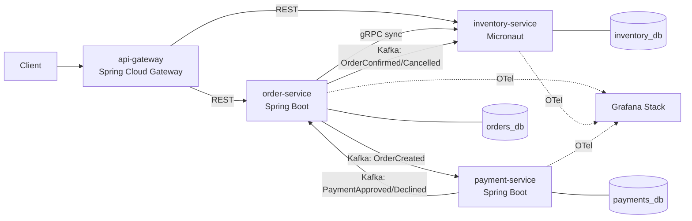

# E-commerce Microservices — Plano Inicial

> Documento de planejamento para desenvolvimento incremental.
> Projeto de estudo: microserviços, Kubernetes, resiliência e observabilidade.

---

## 0. Decisões de stack (e o porquê)

| Item | Escolha | Motivo |
|---|---|---|
| Java | **21 (LTS)** | Java 11 inviabiliza Spring Boot 3. Virtual Threads podem reduzir o custo de concorrência I/O-bound, mas exigem limites nos downstreams. |
| Framework principal | **Spring Boot 3.5** | Continuidade com o projeto anterior — foco vai pra arquitetura, não pra sintaxe. |
| Framework comparativo | **Micronaut 4.x** | Apenas no `inventory-service`. Objetivo: medir startup/RSS vs Spring (DI em compile-time, sem reflection). |
| Broker | **Kafka** (Redpanda no dev) | Redpanda = API-compatível, single binary, sobe em segundos. |
| Sync RPC | **gRPC** | Contract-first com Protobuf. REST fica só na borda (BFF/Gateway). |
| Banco | **PostgreSQL por serviço** | Database-per-service. Um schema compartilhado mataria o propósito. |
| Migrations | **Flyway** | Mesmo do projeto anterior. |
| K8s local | **kind** ou **k3d** | Minikube é mais lento. k3d se quiser Traefik pronto. |
| Empacotamento K8s | **Helm** | Charts por serviço + umbrella chart. |
| Observabilidade | **OTel → Tempo/Prometheus/Loki → Grafana** | OpenTelemetry como padrão único de instrumentação. |

**Aviso:** não use Java 11. Se for requisito externo depois, o downgrade quebra Spring Boot 3, `ProblemDetail`, Virtual Threads e Micronaut 4.

---

## 1. Arquitetura de serviços



### Responsabilidades

| Serviço | Framework | Responsabilidade | Comunicação |
|---|---|---|---|
| `api-gateway` | Spring Cloud Gateway | Roteamento, rate limit, auth JWT | REST in |
| `order-service` | Spring Boot 3.5 | Orquestra o pedido. **Owner da Saga.** | REST in, gRPC out, Kafka pub/sub |
| `inventory-service` | **Micronaut 4** | Estoque, reserva/liberação | gRPC in, Kafka sub |
| `payment-service` | Spring Boot 3.5 | Cobrança (mock de gateway) | Kafka sub/pub |

### Por que cada tipo de comunicação

- **gRPC (`order → inventory`)**: precisa de resposta *agora* — não adianta criar pedido sem saber se tem estoque. Chamada síncrona, protegida por Circuit Breaker.
- **Kafka (`order ↔ payment`)**: pagamento é lento e pode falhar. Assíncrono, retry natural, sem acoplamento temporal.
- **REST (borda)**: cliente HTTP comum não fala gRPC.

> **Regra de ouro que este projeto ensina:** sync onde a decisão é imediata, async onde o processo tolera latência.

---

## 2. Arquitetura interna de cada serviço

Mantém a Clean/Hexagonal do projeto anterior, mas **simplificada**: 4 módulos Maven por serviço × 4 serviços = 16 módulos. Isso vira inferno de build.

**Recomendação:** dentro de cada serviço, use **package-by-layer** (não módulos Maven separados). O isolamento agora vem do *serviço*, não do módulo.

```
order-service/
├── src/main/java/com/ecom/order/
│   ├── domain/           # entidades, VOs, regras — zero framework
│   │   ├── model/
│   │   ├── event/        # OrderCreated, OrderConfirmed (eventos de domínio)
│   │   └── exception/
│   ├── application/
│   │   ├── usecase/
│   │   ├── port/in/
│   │   └── port/out/     # InventoryPort, PaymentPort, OrderRepository, EventPublisher
│   ├── infrastructure/
│   │   ├── persistence/  # JPA + mappers
│   │   ├── grpc/         # InventoryGrpcAdapter (implementa InventoryPort)
│   │   ├── messaging/    # KafkaEventPublisher, consumers
│   │   ├── outbox/       # OutboxEntity, OutboxPoller
│   │   └── config/
│   └── api/
│       ├── controller/
│       ├── dto/
│       └── exception/
└── src/test/
```

**ArchUnit** para garantir a regra de dependência sem módulos Maven:

```java
@AnalyzeClasses(packages = "com.ecom.order")
class ArchitectureTest {
    @ArchTest
    static final ArchRule domain_nao_depende_de_nada =
        noClasses().that().resideInAPackage("..domain..")
            .should().dependOnClassesThat()
            .resideInAnyPackage("..application..", "..infrastructure..", "..api..",
                                "org.springframework..", "jakarta.persistence..");
}
```

---

## 3. Contratos

### Repo layout (monorepo)

```
ecommerce-microservices/
├── contracts/                    # fonte da verdade dos contratos
│   ├── proto/
│   │   └── inventory/v1/inventory.proto
│   └── avro/  (ou json-schema/)
│       └── order-events-v1.avsc
├── services/
│   ├── api-gateway/
│   ├── order-service/
│   ├── inventory-service/        # Micronaut
│   └── payment-service/
├── deploy/
│   ├── docker/                   # docker-compose local
│   └── k8s/
│       ├── charts/               # Helm chart por serviço
│       └── umbrella/             # chart guarda-chuva
├── observability/                # Grafana dashboards, Prom rules, OTel collector
└── docs/adr/                     # Architecture Decision Records
```

> Monorepo aqui é o certo: um único `git clone` e você sobe tudo. Multi-repo só complica o estudo.

### Proto — `inventory.proto`

```protobuf
syntax = "proto3";
package inventory.v1;
option java_multiple_files = true;
option java_package = "com.ecom.inventory.grpc.v1";

service InventoryService {
  rpc CheckAvailability(CheckAvailabilityRequest) returns (CheckAvailabilityResponse);
  rpc ReserveStock(ReserveStockRequest) returns (ReserveStockResponse);
}

message CheckAvailabilityRequest {
  repeated Item items = 1;
}
message Item {
  string sku = 1;
  int32 quantity = 2;
}
message CheckAvailabilityResponse {
  bool available = 1;
  repeated string unavailable_skus = 2;
}
message ReserveStockRequest {
  string order_id = 1;
  repeated Item items = 2;
}
message ReserveStockResponse {
  string reservation_id = 1;
  ReservationStatus status = 2;
}
enum ReservationStatus {
  RESERVATION_STATUS_UNSPECIFIED = 0;
  RESERVATION_STATUS_CONFIRMED = 1;
  RESERVATION_STATUS_REJECTED = 2;
}
```

### Eventos Kafka

| Tópico | Publisher | Consumers | Payload chave |
|---|---|---|---|
| `order.created.v1` | order | payment | orderId, customerId, items[], totalAmount, currency |
| `payment.approved.v1` | payment | order | orderId, paymentId, amount, currency |
| `payment.declined.v1` | payment | order | orderId, reason |
| `order.confirmed.v1` | order | inventory | orderId, reservationId |
| `order.cancelled.v1` | order | inventory | orderId, reservationId, reason |

**Regras:**
- Versionar no nome do tópico (`.v1`) — evolução sem quebrar consumers.
- Chave de partição = `orderId` → garante ordem por pedido.
- Envelope padrão em todo evento:

```json
{
  "eventId": "uuid",
  "eventType": "OrderCreated",
  "occurredAt": "2026-07-12T10:00:00Z",
  "aggregateId": "order-uuid",
  "traceId": "para correlacionar no Tempo",
  "payload": { }
}
```

---

## 4. Saga — Fluxo do pedido (coreografia com orquestrador leve)

O `order-service` é o **owner da saga**. Máquina de estados explícita:

```
PENDING → (reserve stock via gRPC)
  ├─ falha → REJECTED (fim)
  └─ ok → AWAITING_PAYMENT → publica OrderCreated
              ├─ PaymentApproved → CONFIRMED → publica OrderConfirmed
              │                                   └─ inventory: reserva → baixa definitiva
              └─ PaymentDeclined → CANCELLED → publica OrderCancelled
                                                  └─ inventory: libera reserva (compensação)
```

### Estados

```java
public enum OrderStatus {
    PENDING, AWAITING_PAYMENT, CONFIRMED, CANCELLED, REJECTED
}
```

Transições **só via método de domínio** (`order.confirm()`, `order.cancel(reason)`), lançando `IllegalStateTransitionException` se inválida. Nada de `setStatus()`.

### Timeout da saga

Pedido em `AWAITING_PAYMENT` por > N minutos → job agendado cancela e compensa. Sem isso, um payment-service morto deixa pedidos presos pra sempre.

Reserva de estoque também precisa de TTL e reconciliação própria. `ReserveStock`
é idempotente por `orderId`; repetir a chamada devolve a mesma reserva. Se o
pagamento for aprovado depois de a reserva expirar, a confirmação não pode seguir
silenciosamente: a saga deve cancelar o pedido e solicitar estorno/refund.

---

## 5. Padrões de resiliência (implementar nesta ordem)

### 5.1 Transactional Outbox — **obrigatório**

Problema: você salva o pedido no Postgres e publica no Kafka. Se o Kafka cair entre os dois, o pedido existe mas ninguém sabe. `@Transactional` não cobre o broker.

Solução: grava o evento numa tabela `outbox` **na mesma transação** do pedido. Um poller lê e publica.

```sql
CREATE TABLE outbox (
    id UUID PRIMARY KEY,
    aggregate_id UUID NOT NULL,
    topic VARCHAR(200) NOT NULL,
    event_type VARCHAR(100) NOT NULL,
    payload JSONB NOT NULL,
    trace_id VARCHAR(64),
    created_at TIMESTAMPTZ NOT NULL DEFAULT now(),
    published_at TIMESTAMPTZ,
    next_attempt_at TIMESTAMPTZ NOT NULL DEFAULT now(),
    attempts INT NOT NULL DEFAULT 0,
    last_error VARCHAR(1000)
);
CREATE INDEX idx_outbox_unpublished
    ON outbox (next_attempt_at, created_at)
    WHERE published_at IS NULL;
```

Poller com lote limitado e `SELECT ... FOR UPDATE SKIP LOCKED`. O lock impede duas
réplicas de selecionarem a mesma linha simultaneamente, mas não elimina duplicata
quando o processo cai depois do ACK e antes do commit:

```java
@Scheduled(fixedDelay = 500)
@Transactional
public void publishPending() {
    outboxRepository.findUnpublished(BATCH_SIZE)  // FOR UPDATE SKIP LOCKED
        .forEach(evt -> {
            try {
                kafkaTemplate.send(evt.topic(), evt.aggregateId(), evt.payload())
                    .get(5, TimeUnit.SECONDS); // só marca após ACK do broker
                evt.markPublished();
            } catch (Exception ex) {
                evt.scheduleRetry(ex.getMessage());
            }
        });
}
```

> **Isso garante at-least-once, não exactly-once.** Por isso o próximo item é obrigatório.
> O exemplo bloqueante é deliberadamente simples para o projeto. Deve usar lote
> pequeno e timeout; CDC/Debezium é uma evolução possível, não requisito inicial.

Eventos publicados precisam de limpeza/arquivamento. Linhas que excederem o limite
de tentativas vão para estado operacional de falha, com alerta, em vez de retry
infinito.

### 5.2 Idempotência nos consumers

Todo consumer guarda `eventId` processado:

```sql
CREATE TABLE processed_events (
    consumer_name VARCHAR(150) NOT NULL,
    event_id UUID NOT NULL,
    processed_at TIMESTAMPTZ NOT NULL DEFAULT now(),
    PRIMARY KEY (consumer_name, event_id)
);
```

Use `INSERT ... ON CONFLICT DO NOTHING`; se não inseriu, o evento já foi processado.
O insert, a mudança de negócio e o novo outbox devem estar **na mesma transação do
banco do consumer**. Capturar uma exceção de PK depois que a transação JPA foi
marcada para rollback não é suficiente.

`processed_events` também precisa de retenção compatível com a maior janela de
replay do Kafka. Apagar cedo demais reabre a possibilidade de duplicação.

### 5.3 Circuit Breaker + Retry (Resilience4j)

Só na chamada **síncrona** (`order → inventory` via gRPC).

```yaml
resilience4j:
  circuitbreaker:
    instances:
      inventory:
        sliding-window-size: 20
        failure-rate-threshold: 50
        wait-duration-in-open-state: 10s
        permitted-number-of-calls-in-half-open-state: 3
  retry:
    instances:
      inventory:
        max-attempts: 3
        wait-duration: 200ms
        exponential-backoff-multiplier: 2
        retry-exceptions:
          - io.grpc.StatusRuntimeException
  timelimiter:
    instances:
      inventory:
        timeout-duration: 2s
```

**Ordem inicial sugerida:** `Retry(CircuitBreaker(TimeLimiter(call)))`, fazendo o
CB observar cada tentativa. Isso não é universal: se a métrica desejada for uma
falha por operação lógica, CB e Retry podem ser invertidos. Registre a decisão em
teste e retente apenas status transitórios do gRPC (`UNAVAILABLE`,
`DEADLINE_EXCEEDED`), nunca todos os `StatusRuntimeException`.

**Fallback:** se o CB abrir, rejeitar o pedido com `503` é honesto. Não invente estoque.

### 5.4 DLQ (Dead Letter Queue)

Consumer que falha N vezes → manda pra `<topico>.dlq`. Spring Kafka: `DefaultErrorHandler` + `DeadLetterPublishingRecoverer` com backoff exponencial.

Sem DLQ, uma mensagem envenenada trava a partição inteira.
DLQ precisa de alerta, inspeção e procedimento de replay; apenas mover a mensagem
não resolve o processo de negócio.

### 5.5 Não faça (armadilhas)

- ❌ Retry em operação não-idempotente sem chave de idempotência.
- ❌ Circuit Breaker em consumer Kafka (o Kafka já é o buffer — CB ali não faz sentido).
- ❌ Chamada síncrona em cadeia (`A → B → C → D`). Latência e falha se multiplicam.
- ❌ 2PC / XA transactions. Não faça. Saga existe pra isso.

---

## 6. Kubernetes

### 6.1 Progressão sugerida

1. `docker compose` funcionando 100% primeiro. **Não pule.**
2. `kind create cluster` → manifests YAML crus. Entenda Deployment/Service/ConfigMap/Secret.
3. Só então converta pra Helm.

### 6.2 Manifests essenciais por serviço

```yaml
# Deployment — trecho crítico
spec:
  replicas: 2
  template:
    spec:
      containers:
        - name: order-service
          image: ecom/order-service:0.1.0
          ports:
            - containerPort: 8080
              name: http
            - containerPort: 9090
              name: management
          resources:
            requests:  { cpu: 200m, memory: 512Mi }
            limits:    { cpu: 1000m, memory: 1Gi }
          startupProbe:                    # protege boot lento da JVM
            httpGet: { path: /actuator/health/readiness, port: management }
            failureThreshold: 30
            periodSeconds: 2
          readinessProbe:                  # dependências incluídas de forma deliberada
            httpGet: { path: /actuator/health/readiness, port: management }
            periodSeconds: 5
          livenessProbe:                   # só reinicia se travou de verdade
            httpGet: { path: /actuator/health/liveness, port: management }
            periodSeconds: 10
            failureThreshold: 3
          lifecycle:
            preStop:
              exec: { command: ["sh", "-c", "sleep 5"] }   # graceful shutdown
```

**Erros clássicos que este projeto deve evitar:**

| Erro | Consequência |
|---|---|
| Sem `startupProbe` | Liveness mata o pod durante o boot da JVM → CrashLoopBackOff eterno |
| Liveness = Readiness | Uma queda do banco reinicia o pod (que não resolve nada) |
| `limits.memory` sem tuning de heap | OOMKill. Comece com `-XX:MaxRAMPercentage=65` e deixe espaço para metaspace, threads e buffers |
| Sem `preStop` | Pod some do DNS depois de já ter parado de aceitar → 502 no deploy |
| `replicas: 1` | Zero downtime é impossível |

**Configuração Spring pra graceful shutdown:**
```yaml
server:
  shutdown: graceful
spring:
  lifecycle:
    timeout-per-shutdown-phase: 20s
management:
  endpoint.health.probes.enabled: true
  health.livenessState.enabled: true
  health.readinessState.enabled: true
```

### 6.3 Helm

```
deploy/k8s/charts/
├── _common/                  # library chart: labels, probes, resources
├── order-service/
│   ├── Chart.yaml
│   ├── values.yaml           # defaults
│   ├── values-prod.yaml
│   └── templates/
└── umbrella/
    ├── Chart.yaml            # dependencies: order, inventory, payment, gateway
    └── values.yaml
```

Um `library chart` (`_common`) evita copiar o mesmo Deployment 4 vezes.

### 6.4 HPA

```yaml
apiVersion: autoscaling/v2
kind: HorizontalPodAutoscaler
spec:
  minReplicas: 2
  maxReplicas: 10
  metrics:
    - type: Resource
      resource: { name: cpu, target: { type: Utilization, averageUtilization: 70 } }
  behavior:
    scaleDown:
      stabilizationWindowSeconds: 300   # evita flapping
```

> Depois, evolua pra **KEDA** escalando o `payment-service` por *consumer lag* do Kafka. É o caso de uso real de HPA em microserviço orientado a eventos — CPU é um proxy ruim aqui.

### 6.5 Extras (na ordem)

- `PodDisruptionBudget` — `minAvailable: 1`, protege durante drain do nó.
- `NetworkPolicy` — só o gateway fala com os serviços; serviços não falam com o banco alheio.
- `Secret` via **External Secrets Operator** ou pelo menos **SealedSecrets**. Nunca senha em `values.yaml` versionado.

---

## 7. Observabilidade

### 7.1 Stack

| Sinal | Coleta | Store | Visualização |
|---|---|---|---|
| Métricas | Micrometer → OTel | Prometheus | Grafana |
| Traces | OTel Java Agent | Tempo | Grafana |
| Logs | Logback JSON | Loki | Grafana |

**OTel Collector** no meio (DaemonSet). Serviços mandam só pro Collector — trocar backend depois não toca em código.

### 7.2 Instrumentação

Agent (zero código, pega Spring MVC, JDBC, Kafka, gRPC automaticamente):
```dockerfile
ENV JAVA_TOOL_OPTIONS="-javaagent:/otel/opentelemetry-javaagent.jar"
ENV OTEL_SERVICE_NAME=order-service
ENV OTEL_EXPORTER_OTLP_ENDPOINT=http://otel-collector:4317
ENV OTEL_TRACES_SAMPLER=parentbased_traceidratio
ENV OTEL_TRACES_SAMPLER_ARG=0.1
```

**A parte que dá trabalho:** propagar `traceId` **através do Kafka**. O agent já injeta headers W3C `traceparent` no producer e extrai no consumer — mas o Outbox quebra isso (o evento é publicado depois, em outra thread). Por isso o campo `trace_id` na tabela outbox: você reinjeta o contexto na hora de publicar.

> Isso é o detalhe que separa um trace bonito de um trace inútil no Grafana. Vale o esforço.

### 7.3 Métricas de negócio (não só técnicas)

```java
@Component
@RequiredArgsConstructor
public class OrderMetrics {
    private final MeterRegistry registry;

    public void orderCreated(String status) {
        registry.counter("orders_total", "status", status).increment();
    }

    public Timer.Sample startSaga() { return Timer.start(registry); }
    public void endSaga(Timer.Sample s, String outcome) {
        s.stop(registry.timer("saga_duration_seconds", "outcome", outcome));
    }
}
```

**Cuidado com cardinalidade:** nunca use `orderId` ou `customerId` como *tag* de métrica. Isso explode o Prometheus. Use como atributo de *trace* ou campo de *log*.

### 7.4 Dashboards Grafana (versionar como JSON em `observability/`)

1. **Golden Signals** — latência (p50/p95/p99), tráfego, erro (5xx rate), saturação (CPU/heap/pool de conexões).
2. **Saga Health** — pedidos por status, duração da saga, taxa de compensação, timeouts.
3. **Kafka** — consumer lag por grupo, throughput, mensagens em DLQ.
4. **Resilience4j** — estado do CB (open/half-open/closed), taxa de retry.

### 7.5 Alertas (Prometheus rules)

```yaml
- alert: HighDLQRate
  expr: rate(kafka_dlq_messages_total[5m]) > 0
  for: 2m
- alert: CircuitBreakerOpen
  expr: resilience4j_circuitbreaker_state{state="open"} == 1
  for: 1m
- alert: SagaStuck
  expr: orders_awaiting_payment_seconds > 300
```

---

## 8. Micronaut no `inventory-service`

Objetivo: **comparar**, não só usar.

| Aspecto | Spring Boot 3 | Micronaut 4 |
|---|---|---|
| DI | Runtime (reflection) | **Compile-time** (annotation processor) |
| Startup | ~2-4s | **~200-500ms** |
| RSS típico | ~350-500 MB | **~120-200 MB** |
| Native image | Possível (AOT, chato) | **Nativo desde o design** |
| Ecossistema | Enorme | Menor |

Meça e documente em `docs/adr/`:
```bash
# startup
time curl -s localhost:8081/health

# memória real do container
kubectl top pod -l app=inventory-service
```

> Onde isso importa de verdade: escalar de 2 → 20 pods em segundos, ou funções serverless. Se o serviço fica up 24/7 com 3 réplicas, a diferença é acadêmica. **Escreva isso no ADR** — saber quando *não* usar é a boa prática.

---

## 9. Roadmap incremental

Cada fase deve **rodar e ser testável** antes da próxima. Não pule.

### Fase 1 — Fundação endurecida
- [x] Monorepo, parent pom, `.editorconfig`, `.gitignore`
- [x] `order-service`: CRUD, Postgres, Flyway, Clean Arch + ArchUnit
- [x] `Idempotency-Key` transacional, optimistic locking e constraints de duplicidade
- [x] Paginação limitada sem materializar itens, limites de request e preço confiável
- [x] Prometheus, readiness, Virtual Threads e management port separado
- [x] `docker-compose.yml`: postgres × 3, Redpanda e Console com versões fixas
- [x] Testcontainers local; execução automática no CI permanece na Fase 6

### Fase 2 — Comunicação (prioridade #1)
- [x] `contracts/proto/` + geração via `protobuf-maven-plugin`
- [x] `inventory-service` em **Micronaut** expondo gRPC
- [x] `order-service` chama inventory via gRPC (`InventoryGrpcAdapter implements InventoryPort`)
- [x] `payment-service` com Kafka: consome `order.created.v1`, publica `payment.approved/declined`
- [x] Envelope de evento padronizado
- [x] Reserva idempotente por `orderId`, TTL e decremento atômico para não vender estoque negativo
- [x] Pagamento único por `orderId` e chave idempotente no gateway mock
- [ ] Teste de integração ponta-a-ponta com Testcontainers (Kafka + Postgres + gRPC)

### Fase 3 — Consistência e resiliência (prioridade #2)
- [ ] Transactional Outbox no `order-service`
- [ ] Inbox/idempotência (`processed_events`) atômica em todos os consumers
- [ ] Saga completa com compensação (cancel → libera reserva)
- [ ] Resilience4j: CB + Retry + TimeLimiter no gRPC
- [ ] DLQ + `DefaultErrorHandler` com backoff
- [~] Timeout de saga: jobs cancelam o pedido e liberam a reserva; falta integrar o refund no payment-service
- [ ] Retenção/limpeza de outbox, inbox e DLQ; alerta para evento esgotado
- [ ] Concorrência: approved/declined/timeout, evento repetido e evento atrasado

### Fase 4 — Kubernetes (prioridade #3)
- [ ] Dockerfiles multi-stage + JRE slim (não use `openjdk:21`, use `eclipse-temurin:21-jre-alpine`)
- [ ] `kind` cluster + manifests YAML crus
- [ ] Probes (startup/readiness/liveness) + graceful shutdown
- [ ] Converter pra Helm + library chart `_common`
- [ ] Umbrella chart: `helm install ecom ./umbrella` sobe tudo
- [ ] Ingress (nginx) + HPA
- [ ] PDB + NetworkPolicy
- [ ] **Teste de caos**: `kubectl delete pod payment-service` no meio de um pedido → o pedido tem que se resolver sozinho

### Fase 5 — Observabilidade (prioridade #4)
- [ ] OTel Collector + Prometheus + Tempo + Loki + Grafana no compose
- [ ] Java Agent nos 4 serviços
- [ ] Propagação de traceId através do Outbox
- [ ] Logs JSON estruturados com `traceId`/`spanId`
- [ ] 4 dashboards versionados em JSON
- [ ] Alert rules

### Fase 6 — Polimento
- [ ] `api-gateway` (Spring Cloud Gateway) + JWT; `customerId` vem do subject
- [ ] Substituir catálogo local por fonte confiável atrás de `PricingPort`
- [ ] KEDA escalando payment por consumer lag
- [ ] CI: GitHub Actions (`mvn verify` + build de imagem + `helm lint`)
- [ ] ADRs documentando as decisões

---

## 10. `docker-compose.yml` — esqueleto

```yaml
services:
  postgres-orders:
    image: postgres:16-alpine
    environment: { POSTGRES_DB: orders, POSTGRES_USER: ecom, POSTGRES_PASSWORD: ecom }
    ports: ["5433:5432"]

  postgres-inventory:
    image: postgres:16-alpine
    environment: { POSTGRES_DB: inventory, POSTGRES_USER: ecom, POSTGRES_PASSWORD: ecom }
    ports: ["5434:5432"]

  postgres-payments:
    image: postgres:16-alpine
    environment: { POSTGRES_DB: payments, POSTGRES_USER: ecom, POSTGRES_PASSWORD: ecom }
    ports: ["5435:5432"]

  redpanda:
    image: docker.redpanda.com/redpandadata/redpanda:v26.1.9
    command: >
      redpanda start --smp 1 --memory 512M --overprovisioned
      --kafka-addr PLAINTEXT://0.0.0.0:29092,OUTSIDE://0.0.0.0:9092
      --advertise-kafka-addr PLAINTEXT://redpanda:29092,OUTSIDE://localhost:9092
    ports: ["9092:9092", "9644:9644"]

  redpanda-console:
    image: docker.redpanda.com/redpandadata/console:v3.9.0
    environment: { KAFKA_BROKERS: redpanda:29092 }
    ports: ["8090:8080"]
    depends_on: [redpanda]

  # Fase 5
  # Fixar versões verificadas ao implementar; nunca usar latest.
  otel-collector: { image: "otel/opentelemetry-collector-contrib:<versao-fixada>" }
  prometheus:     { image: "prom/prometheus:<versao-fixada>" }
  tempo:          { image: "grafana/tempo:<versao-fixada>" }
  loki:           { image: "grafana/loki:<versao-fixada>" }
  grafana:        { image: "grafana/grafana:<versao-fixada>", ports: ["3000:3000"] }
```

---

## 11. Convenções

- Java 21, records para DTOs/eventos/VOs, `sealed` para resultados de saga
- Lombok só `@RequiredArgsConstructor` + campos `final`. **Nunca `@Data` em entidade JPA** (`equals`/`hashCode` quebram com proxy do Hibernate)
- `@Transactional(readOnly = true)` na classe do use case, sobrescrito nos writes
- Domain nunca importa `org.springframework` nem `jakarta.persistence` — garantido por ArchUnit
- Erros HTTP via `ProblemDetail` (RFC 7807)
- Migration Flyway: `V{n}__{descricao}.sql`, nunca editar aplicada
- Toda listagem tem paginação com limite máximo; nada de `findAll()` em API
- Operação mutável com retry exige chave idempotente e constraint no banco
- Requests/eventos têm limite de itens e tamanho; consumers usam lotes limitados
- Nome de tópico Kafka: `<agregado>.<evento>.v<versão>` em kebab/dot-case
- Imagem Docker: multi-stage, `eclipse-temurin:21-jre-alpine`, usuário não-root, começar com `-XX:MaxRAMPercentage=65`

---

## 12. Perguntas em aberto (decidir com ADR)

1. **Serialização Kafka**: JSON (simples, debugável) vs Avro + Schema Registry (contrato forte, evolução segura). Sugestão: começar JSON, migrar pra Avro na Fase 3 — o *processo* de migrar é o aprendizado.
2. **Service Mesh (Istio/Linkerd)**: mTLS e retry na malha, sem código. Mas se o mesh faz retry e o Resilience4j também, você retenta 9× sem saber. Sugestão: **não usar agora**. Aprenda resiliência no código primeiro.
3. **Coreografia vs Orquestração**: este plano usa orquestração leve (order como owner). Alternativa pura em coreografia é mais desacoplada e muito mais difícil de debugar. Fique com a orquestração.
4. **Native image (GraalVM)**: só depois da Fase 5, e só no `inventory-service` pra medir contra o JVM mode.
